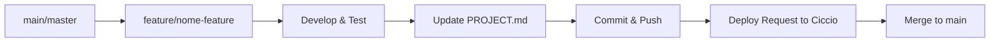

# BRANCH_STRATEGY.md - Git Workflow Strategy

**Strategia di branching standardizzata per 80/20 Solutions**

## 🎯 Overview

Utilizziamo un **simplified Git Flow** ottimizzato per small team con AI-assisted development e deployment automatici.



## 🌿 Branch Types

### **📦 main/master** - Production Branch
- **Purpose**: Codice pronto per production
- **Protection**: Protected branch, require PR per changes
- **Deploy**: Auto-deploy o deploy da Ciccio su richiesta
- **Naming**: `main` per nuovi progetti, `master` per esistenti

### **⚡ feature/** - Feature Development  
- **Purpose**: Sviluppo new features
- **Lifetime**: Temporary, deleted dopo merge
- **Naming**: `feature/descrizione-breve`
- **Examples**:
  ```bash
  feature/user-authentication
  feature/dark-mode-ui
  feature/ai-integration-phase2
  ```

### **🐛 fix/** - Bug Fixes
- **Purpose**: Correzione bug specifici
- **Lifetime**: Temporary, deleted dopo merge  
- **Naming**: `fix/descrizione-problema`
- **Examples**:
  ```bash
  fix/login-timeout-issue  
  fix/database-connection-error
  fix/ui-responsive-mobile
  ```

### **🚑 hotfix/** - Critical Production Fixes
- **Purpose**: Fix urgenti in production
- **Lifetime**: Very short, immediate merge
- **Naming**: `hotfix/descrizione-critica`
- **Priority**: Highest priority, immediate attention

### **📚 docs/** - Documentation Only
- **Purpose**: Solo modifiche documentazione
- **Lifetime**: Short, quick merge
- **Naming**: `docs/descrizione-update`

## 🔄 Standard Workflow

### **1. 🚀 Start New Feature**
```bash
# Sync with main
git checkout main
git pull origin main

# Create feature branch  
git checkout -b feature/my-new-feature

# Start development...
```

### **2. 👨‍💻 Development Process**
```bash
# Regular commits during development
git add .
git commit -m "feat: implement user authentication logic"

# The commit skin automatically:
# - Updates PROJECT.md version
# - Builds project artifacts  
# - Stages release files
# - Enhances commit message
```

### **3. 🔄 Push and Deploy Request**
```bash
# Push to GitHub
git push origin feature/my-new-feature

# Notify Ciccio for deploy to test environment
# Via Telegram: "Ciccio, deploy feature/my-new-feature su test"
```

### **4. ✅ Testing & Approval**  
- Ciccio deploys to test environment
- David reviews and approves feature
- Any fixes: additional commits on feature branch

### **5. 🎯 Merge to Production**
```bash
# Switch to main
git checkout main
git pull origin main

# Merge feature branch
git merge feature/my-new-feature

# Update PROJECT.md if needed (usually automatic via skin)
git push origin main

# Clean up
git branch -d feature/my-new-feature
git push origin --delete feature/my-new-feature
```

## 🚀 Deploy Workflow Integration

### **🧪 Test Deployments**
- **Trigger**: Push to feature branch + request to Ciccio
- **Environment**: test-*.8020solutions.org subdomain  
- **Purpose**: Validation before production
- **Lifetime**: Temporary, cleaned up after merge

### **🌐 Production Deployments**  
- **Trigger**: Merge to main + deploy request to Ciccio
- **Environment**: Production URLs (live domains)
- **Approval**: David approval required
- **Process**: 
  1. Ciccio pulls main branch
  2. Builds from releases/ artifacts
  3. Deploys to production
  4. Health checks and verification
  5. Reports success to David

## 📋 Branch Protection Rules

### **Main/Master Branch**
- ✅ **Require pull request reviews**: 1 reviewer (David or Ciccio)
- ✅ **Dismiss stale reviews**: When new commits pushed
- ✅ **Require status checks**: CI must pass
- ✅ **Require up-to-date branches**: Must be current with main
- ✅ **Include administrators**: Rules apply to everyone

### **Feature Branches**  
- ✅ **No protection**: Freedom for rapid development
- ✅ **CI checks**: Optional but recommended
- ✅ **Self-merge allowed**: Claudio can merge own features dopo approval

## 🎭 Role-Specific Workflows

### **👨‍💻 Claudio (Developer)**
1. **Create feature branch** from main
2. **Develop with commit skin** automation
3. **Push and request deploy** to test environment  
4. **Iterate based on feedback**
5. **Merge to main** when approved

### **🧠 Ciccio (Orchestrator)**  
1. **Deploy feature branches** to test environments
2. **Monitor CI/CD** status and health checks
3. **Deploy main branch** to production on request
4. **Manage branch cleanup** and repository hygiene

### **🎯 David (Product Owner)**
1. **Review test deployments** and approve features
2. **Approve production deployments**  
3. **Create GitHub Issues** for new requirements
4. **Strategic branch decisions** (releases, hotfixes)

## 📊 Branch Naming Conventions

### **✅ Good Branch Names**
```bash
feature/user-authentication
feature/ai-integration-phase3
feature/mobile-responsive-ui

fix/login-timeout-error  
fix/database-connection-retry
fix/payment-gateway-validation

hotfix/critical-security-patch
hotfix/production-database-error

docs/api-documentation-update
docs/deployment-guide-revision
```

### **❌ Avoid These Names**
```bash
❌ dev, development, test
❌ claudio-work, temp-branch  
❌ feature-1, fix-bug
❌ working-branch, latest-changes
```

## 🔧 Git Configuration

### **Recommended Git Config**
```bash
# Set up conventional commit template
git config commit.template ~/.gitmessage

# Auto-setup tracking for new branches
git config push.autoSetupRemote true

# Use rebase for cleaner history
git config pull.rebase true

# Better merge conflict markers
git config merge.conflictstyle diff3
```

### **Commit Message Template** (~/.gitmessage)
```
# <type>[optional scope]: <description>
#
# [optional body]
#
# [optional footer(s)]
#
# Types: feat, fix, docs, style, refactor, test, chore
# Breaking changes: add ! after type or BREAKING CHANGE: in footer
```

## 🚨 Emergency Procedures

### **🚑 Hotfix Process**
1. **Create hotfix branch** from main immediately
2. **Implement critical fix** with minimal changes
3. **Test thoroughly** but quickly
4. **Deploy immediately** to production (bypass normal review)
5. **Notify stakeholders** of emergency deployment
6. **Document incident** and post-mortem

### **🔄 Rollback Process**  
1. **Identify problematic commit** in main
2. **Create revert commit**:
   ```bash
   git revert <commit-hash>
   git push origin main
   ```
3. **Emergency deploy** reverted state
4. **Investigate root cause** in separate branch
5. **Fix and re-deploy** when ready

## 📈 Metrics & KPIs

### **Branch Health Metrics**
- **Feature branch lifetime**: Target <1 week
- **Time to merge**: Target <24h after completion  
- **Failed merges**: Target <5% merge conflicts
- **Hotfix frequency**: Target <1 per month

### **Deploy Success Rate**
- **Test deployments**: Target >95% success  
- **Production deployments**: Target >99% success
- **Rollback rate**: Target <2% of deployments
- **Deploy time**: Target <10min for standard deploys

---

**Best Practices**:
- ✅ Keep feature branches **small and focused**
- ✅ **Update PROJECT.md** before every significant commit
- ✅ **Test locally** before pushing
- ✅ **Communicate with team** about branch progress
- ✅ **Clean up branches** after successful merge