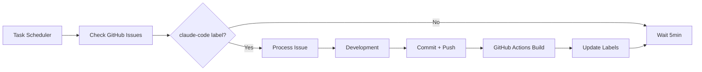

# Claude Code PC Setup - Windows Auto-Start & GitHub Issues Monitor

## 🎯 OBIETTIVO
Configurazione automatica di Claude Code su PC Windows per:
- **Issue monitoring** ogni 5 minuti tramite GitHub CLI
- **Auto-start** all'avvio di Windows
- **Development workflow** automatizzato con GitHub Actions build
- **Zero manual intervention** dopo setup iniziale

## 🚀 QUICK INSTALL

**Scarica ed esegui lo script di installazione:**
```powershell
# PowerShell (Administrator)
irm https://raw.githubusercontent.com/ecologicaleaving/workflow/master/scripts/install-claude-pc.ps1 | iex
```

**O installazione manuale:**
```powershell
# Download script
Invoke-WebRequest -Uri "https://raw.githubusercontent.com/ecologicaleaving/workflow/master/scripts/install-claude-pc.ps1" -OutFile "install-claude-pc.ps1"

# Run installer
.\install-claude-pc.ps1
```

## 📋 COSA INSTALLA LO SCRIPT

### **1. Directory Structure**
```
C:\claude-workspace\
├── scripts\
│   ├── claude-monitor.ps1        # Main monitoring logic
│   ├── claude-monitor.bat        # Batch wrapper
│   └── startup-task.xml          # Task Scheduler config
├── repos\                        # Git repositories workspace
├── logs\
│   ├── monitor.log              # Activity log
│   └── error.log                # Error log
└── config\
    └── settings.json            # Configuration
```

### **2. Dependencies Check & Install**
- **GitHub CLI** (gh) - automatic install if missing
- **Claude CLI** - verificazione disponibilità 
- **Git** - verificazione configurazione
- **PowerShell** - execution policy setup

### **3. Windows Task Scheduler**
- **Task Name**: "Claude Code Issue Monitor"
- **Trigger**: Every 5 minutes + startup
- **User**: Current user (no admin needed for runtime)
- **Background**: Hidden, always running

### **4. Auto-Configuration**
- GitHub authentication check
- Repository access verification  
- Log rotation setup
- Error handling and recovery

## 📊 MONITORING WORKFLOW

### **Claude Code Process (Every 5 Minutes):**


### **Issue Label Flow:**
```
claude-code → in-progress → building → review-ready → deployed-test
     ↑              ↑           ↑            ↑             ↑
Claude Code    Claude Code   GitHub     GitHub      Ciccio VPS
  (start)      (working)     Actions    Actions     (deploy)
```

## 🛠️ SCRIPT COMPONENTS

### **claude-monitor.ps1** (Core Logic)
- GitHub issue polling every 5 minutes
- Claude CLI integration for development
- Automatic git operations (clone, commit, push)
- Label management and issue commenting
- Error handling and logging

### **claude-monitor.bat** (Entry Point)
- Simple batch wrapper for Task Scheduler
- PowerShell execution with proper policies
- Log redirection and error capture

### **startup-task.xml** (Windows Task)
- Task Scheduler XML configuration
- Startup trigger + recurring 5-minute interval
- Background execution, no user interruption
- Network dependency and retry logic

## 📈 MONITORING & LOGS

### **Real-time Monitoring:**
```powershell
# Watch logs in real-time
Get-Content C:\claude-workspace\logs\monitor.log -Wait -Tail 20

# Check recent errors
Get-Content C:\claude-workspace\logs\error.log -Tail 10

# Task status
Get-ScheduledTask "Claude Code Issue Monitor" | Get-ScheduledTaskInfo
```

### **Status Dashboard:**
```powershell
# Quick status check
C:\claude-workspace\scripts\status.ps1

# Manual trigger (testing)
C:\claude-workspace\scripts\claude-monitor.bat
```

## 🔧 MANUAL CONFIGURATION (IF NEEDED)

### **GitHub CLI Authentication:**
```bash
# If not automatically configured
gh auth login --web
gh auth status

# Test repository access  
gh issue list --repo ecologicaleaving/StageConnect --limit 1
```

### **Claude CLI Verification:**
```bash
# Test Claude CLI availability
claude --version
claude "Hello, testing Claude CLI integration"
```

### **Task Scheduler Manual Setup:**
```powershell
# Import task manually if needed
Register-ScheduledTask -TaskName "Claude Code Issue Monitor" -Xml (Get-Content C:\claude-workspace\scripts\startup-task.xml | Out-String)

# Start task
Start-ScheduledTask "Claude Code Issue Monitor"

# Check task history
Get-WinEvent -FilterHashtable @{LogName='Microsoft-Windows-TaskScheduler/Operational'; ID=100,102,103,106,129,200,201} -MaxEvents 10
```

## 🐛 TROUBLESHOOTING

### **Common Issues:**

**GitHub CLI not authenticated:**
```powershell
gh auth status
# If needed: gh auth login --web
```

**Claude CLI not found:**
```bash
# Add Claude CLI to PATH or install
# Check Claude CLI documentation for installation
```

**Task not running:**
```powershell
# Check task scheduler status
Get-ScheduledTask "Claude Code Issue Monitor"

# Check Windows Event Log
Get-WinEvent -FilterHashtable @{LogName='Microsoft-Windows-TaskScheduler/Operational'} -MaxEvents 5
```

**Permission issues:**
```powershell
# Run PowerShell as Administrator
Set-ExecutionPolicy -ExecutionPolicy RemoteSigned -Scope LocalMachine

# Or for current user only
Set-ExecutionPolicy -ExecutionPolicy RemoteSigned -Scope CurrentUser
```

### **Diagnostic Commands:**
```powershell
# Full diagnostic
C:\claude-workspace\scripts\diagnose.ps1

# Reset configuration
C:\claude-workspace\scripts\reset-config.ps1

# Uninstall completely
C:\claude-workspace\scripts\uninstall.ps1
```

## ✅ SUCCESS INDICATORS

**Setup Complete When:**
1. ✅ Task Scheduler shows "Claude Code Issue Monitor" running
2. ✅ Logs show successful GitHub polling every 5 minutes
3. ✅ Test issue with `claude-code` label gets processed automatically
4. ✅ GitHub repository shows automated commits from Claude Code
5. ✅ Issue labels update automatically through the workflow

**Expected Behavior:**
- Silent background operation
- Automatic issue processing
- GitHub integration working
- Logs updating regularly
- No user intervention needed

## 🔄 INTEGRATION WITH 80/20 SOLUTIONS WORKFLOW

### **Team Coordination:**
- **Davide**: Creates issues with `claude-code` label
- **Claude Code (PC)**: Automatically processes development tasks
- **GitHub Actions**: Builds and creates releases
- **Ciccio (VPS)**: Deploys from releases to test environment
- **Result**: Fully automated development pipeline

### **Repository Coverage:**
- StageConnect, BeachRef-app, x32-Assist
- GridConnect, finn, progetto-casa, Maestro
- AutoDrum and future projects

---

**Status:** Ready for one-click PC installation ✅  
**Command:** `irm https://raw.githubusercontent.com/ecologicaleaving/workflow/master/scripts/install-claude-pc.ps1 | iex`