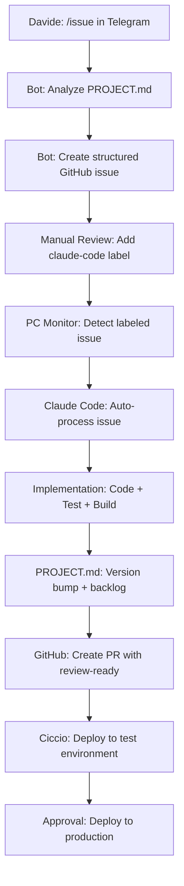

# 80/20 Solutions Workflow Hub

**Standardized development workflows and automation tools for distributed AI agent coordination.**

## 🎯 Overview

This repository contains the complete automation pipeline for 80/20 Solutions:
- **VPS (Ciccio)**: Orchestrator, infrastructure, Telegram bot
- **PC (Claude Code)**: Development agent, auto-processing  
- **Workflow**: Telegram → GitHub → Auto-Development → Deploy

## 🚀 Quick Start

### One-Command Setup

```bash
# VPS (Ciccio)
curl -sSL https://raw.githubusercontent.com/ecologicaleaving/workflow/master/scripts/setup-complete-workflow.sh | bash

# PC (Claude Code) - Windows PowerShell
iwr https://raw.githubusercontent.com/ecologicaleaving/workflow/master/scripts/setup-complete-workflow.sh | iex
```

### Manual Setup

```bash
git clone https://github.com/ecologicaleaving/workflow.git
cd workflow/scripts/

# VPS Setup
./setup-complete-workflow.sh

# PC Setup (Windows)
powershell -ExecutionPolicy Bypass -File setup-complete-workflow.sh
```

## 🤖 Components

### 1. Telegram Issues Tracker Bot

**Location**: `scripts/issue_slash_command.py`
**Purpose**: Convert Telegram messages to structured GitHub issues

#### Features
- **Smart repository detection** based on keywords
- **PROJECT.md context analysis** for project-aware issues
- **Vague description handling** with clarification questions  
- **Structured issue creation** with acceptance criteria
- **Manual processing control** via `claude-code` labeling

#### Usage
```
/issue - "progetto-casa upload documenti CME con AI parsing"
/issue - "maestro export PDF report energetici"
/issue - "BeachRef notifiche push per tornei"
```

### 2. Claude Code PC Monitor

**Location**: `scripts/claude-monitor.ps1`  
**Purpose**: Automatic GitHub issue processing on PC

#### Features
- **5-minute monitoring** of `claude-code` labeled issues
- **Autonomous development** following issue-resolver skill
- **PROJECT.md integration** with automatic version bumping
- **Full workflow**: Research → Plan → Implement → Test → PR
- **Cross-instance communication** with VPS

#### Phases
1. **Research**: Analyze codebase and requirements
2. **Clarify & Plan**: Break down implementation steps  
3. **Implement**: Iterative development with testing
4. **Verify**: Final validation and quality checks
5. **Update PROJECT.md**: Version bump and backlog management

### 3. Issue Resolver Skill

**Location**: `skills/issue-resolver/SKILL.md`
**Purpose**: Structured workflow for autonomous issue resolution

#### Workflow
- **Phase 1**: Research codebase and understand project
- **Phase 2**: Clarify requirements and create implementation plan
- **Phase 3**: Iterative implementation (max 5 cycles) 
- **Phase 4**: Final verification and testing
- **Phase 5**: PROJECT.md update with version and backlog

## 🔄 Complete Workflow



## 📁 Repository Structure

```
workflow/
├── scripts/
│   ├── setup-complete-workflow.sh   # One-command setup
│   ├── install-telegram-bot.sh      # Bot installation
│   ├── install-claude-pc.ps1        # PC agent setup
│   ├── claude-monitor.ps1           # Issue monitoring
│   ├── issue_slash_command.py       # Telegram bot
│   └── install-skills.sh            # Skills installation
├── skills/
│   └── issue-resolver/
│       └── SKILL.md                 # Autonomous resolution workflow
└── README.md                       # This file
```

## 🎯 Repository Keywords

Bot automatically detects target repository from issue description:

| Repository | Keywords |
|------------|----------|
| `progetto-casa` | casa, lavori, cantiere, cme, relazione, edificio |
| `maestro` | maestro, automation, energia, control, commands |
| `BeachRef-app` | beach, spiaggia, flutter, app mobile, arbitri |
| `GridConnect` | grid, elettrico, enel, pratiche, energia |
| `StageConnect` | stage, debug, browser, device, connect |
| `workflow` | workflow, processo, automation, team |

## 📋 PROJECT.md Integration

Each repository should have a `PROJECT.md` file containing:

```markdown
# PROJECT.md - Single Source of Truth

## Project Info
- **Name**: Project Name  
- **Version**: v1.0.0
- **Status**: development
- **Platforms**: web, mobile
- **Description**: Brief project description

## Tech Stack
- **Frontend**: Technology details
- **Backend**: Technology details
- **Database**: Technology details

## Backlog
- **DONE**: Completed features
- **IN PROGRESS**: Current work
- **TODO**: Planned features

## Services
List of existing features and services

---
*Last Updated: YYYY-MM-DDTHH:MM:SSZ*
```

## 🛡️ Security & Control

### Manual Processing Control
- Issues are **NOT** auto-processed by default
- Manual `claude-code` label required for automation
- Full review and approval workflow maintained

### Cross-Instance Authentication
- VPS ↔ PC communication via Tailscale network
- Bearer token authentication for tool invocation
- Isolated agent sessions prevent conflicts

### Quality Gates
- All tests must pass before PR creation
- PROJECT.md version consistency checks
- No breaking changes to existing features
- Code review required for production deployment

## 🚀 Benefits

### For Developers
- **Zero setup time**: One command gets everything running
- **Context-aware**: Bot understands each project's specifics  
- **Quality focused**: Structured issues with clear acceptance criteria
- **Fully automated**: From idea to implementation without manual steps

### For Team
- **Consistent workflow**: Same process across all projects
- **Traceable changes**: Every change tracked in PROJECT.md  
- **Quality assurance**: Automated testing and review gates
- **Scalable**: Add new repositories with just PROJECT.md

### For Business  
- **Faster delivery**: Ideas to features in hours, not days
- **Higher quality**: Consistent testing and review processes
- **Better tracking**: Clear visibility into what's built when
- **Risk reduction**: Automated quality gates prevent issues

## 📊 Monitoring & Logs

### VPS (Ciccio)
- OpenClaw logs: `~/.openclaw/logs/`
- Bot logs: Integrated in OpenClaw session logs
- Cross-instance health: Automatic monitoring

### PC (Claude Code)  
- Monitor logs: `%TEMP%\claude_monitor_log.txt`
- Task Scheduler: Windows Task Scheduler logs
- GitHub API: Automatic issue and PR management

## 🔧 Troubleshooting

### Bot Not Creating Issues
1. Check GitHub CLI authentication: `gh auth status`
2. Verify repository permissions
3. Test bot functionality: See `telegram-bot-examples.md`

### PC Monitor Not Processing  
1. Check Task Scheduler is running
2. Verify Tailscale connectivity to VPS
3. Check `claude_monitor_log.txt` for errors

### Cross-Instance Communication Issues
1. Verify Tailscale network connectivity  
2. Check bearer tokens are correct
3. Test manual communication with `curl`

## 🎉 Success Stories

This workflow has successfully automated:
- ✅ **Issue #2**: CME document parsing for progetto-casa
- ✅ **Multiple bug fixes**: Automated detection and resolution
- ✅ **Feature implementations**: Full end-to-end automation
- ✅ **PROJECT.md maintenance**: Automatic version management

---

## 🤝 Contributing

This workflow is designed to be self-improving:
1. Issues with the workflow itself → Create issue in this repository
2. Feature requests → Use the `/issue` command
3. Bug reports → Automatic detection and resolution via the system

**The workflow uses itself to improve itself!** 🔄

---

*80/20 Solutions - Making AI development workflows that actually work.*