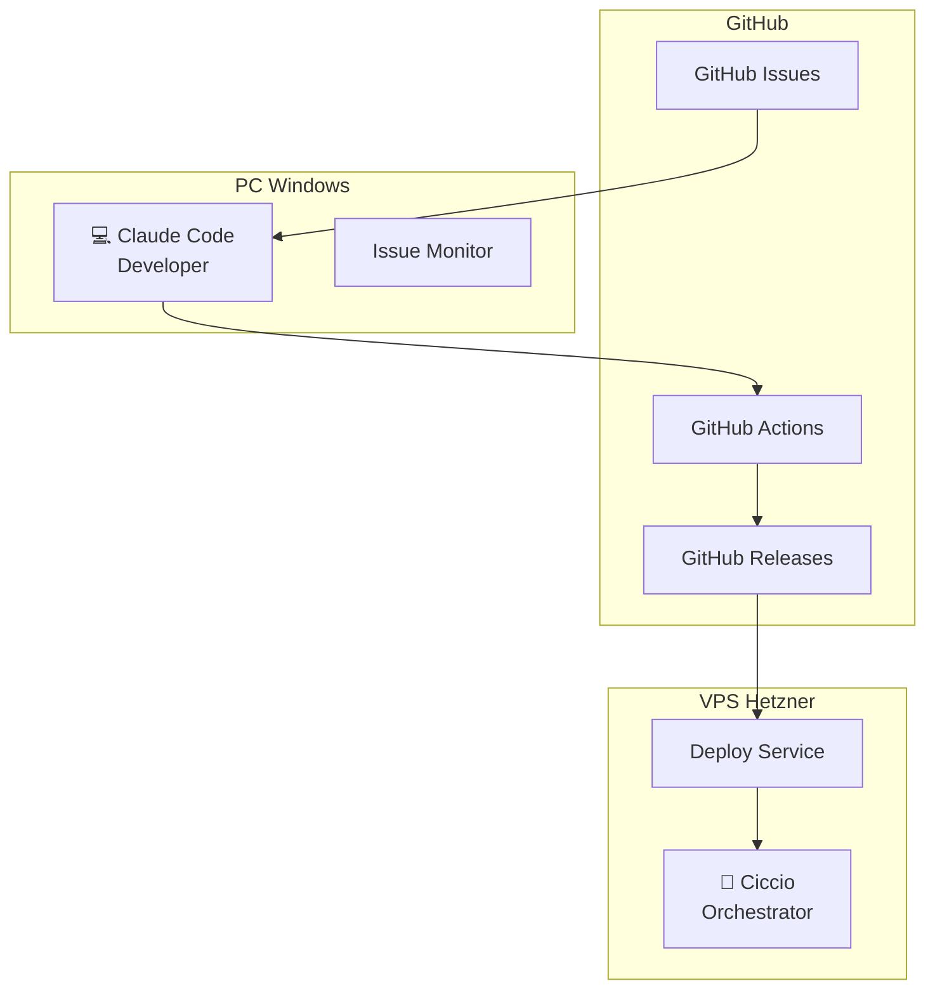

# 🚀 Workflow Repository - 80/20 Solutions

Repository centralizzato per configurazioni, script e documentazione del workflow ibrido **Ciccio (VPS) + Claude Code (PC) + GitHub Actions**.

## 🏗️ Architettura Sistema



## ⚡ Quick Start

### 1. Setup Automatico Completo

```bash
# Clone repository
git clone https://github.com/ecologicaleaving/workflow.git
cd workflow

# Esegui setup automatico
./setup-hybrid-workflow.sh
```

### 2. Setup Componenti Singoli

```bash
# Solo GitHub Actions per tutti i repository
./setup-hybrid-workflow.sh --github-only

# Solo configurazione label
./setup-hybrid-workflow.sh --labels-only

# Solo verifica configurazione esistente
./setup-hybrid-workflow.sh --verify-only
```

### 3. Setup PC Windows (dopo setup VPS)

```powershell
# Su PC Windows, come Administrator
.\scripts\install-claude-pc.ps1
```

## 📋 Workflow Coordinamento

### Label System
- `claude-code` → Assegnazione automatica a Claude Code (PC)
- `ciccio` → Assegnazione a Ciccio (VPS) 
- `building` → GitHub Actions in corso
- `review-ready` → Build completato, pronto per deploy
- `deployed-test` → Deployato in test environment
- `in-progress` → In lavorazione manuale

### Flusso Automatico

```
1. 📝 Issue creato con label 'claude-code'
   └── Claude Code (PC) rileva issue ogni 5min

2. 🧠 Analisi + Planning + Context Clearing
   └── Goal extraction, planning iterativo

3. 💻 Development + Commit
   └── Implementazione, test, push

4. 🏗️ GitHub Actions Build
   └── Auto-trigger su push, build multi-platform

5. 📦 GitHub Release 
   └── APK, web builds, artifacts automatici

6. 🚀 Deploy VPS (Ciccio)
   └── Pull da releases/, deploy test environment

7. ✅ Notification + Review
   └── Link test environment, pronto per produzione
```

## 📂 Struttura Repository

```
workflow/
├── setup-hybrid-workflow.sh      # 🔧 Setup automatico principale
├── scripts/
│   ├── install-claude-pc.ps1     # 🪟 Installer PowerShell PC
│   ├── claude-monitor.ps1        # 📊 Monitor GitHub issues
│   ├── github-actions-build-workflow.yml  # ⚙️ CI/CD template
│   └── deploy-from-github-releases.md     # 📖 Deploy guide
├── CLAUDE_CODE_PC_SETUP.md       # 📋 Guida setup PC completa
├── WORKFLOW_*.md                 # 📚 Documentazione ruoli
└── commit-automation/            # 🤖 Convenzioni commit
```

## 🎯 Repository Coperti

Il sistema supporta automaticamente questi repository:

- **StageConnect** - Browser↔device debug tool
- **BeachRef-app** - Beach reference Flutter app  
- **x32-Assist** - Behringer X32 assistant
- **GridConnect** - Sistema automazione pratiche elettriche
- **finn** - Financial tools
- **progetto-casa** - Casa management system
- **Maestro** - Core business platform
- **AutoDrum** - Automatic drumming system

## 🔧 Configurazione Manuale

### Prerequisiti VPS (Ciccio)
- OpenClaw Gateway in esecuzione
- Cron job CI Monitor attivo (ogni 5min)
- Deploy directory: `/var/www/app-hub/downloads/`

### Prerequisiti PC (Claude Code)  
- Windows 10/11
- PowerShell 5.1+
- Accesso GitHub (token o SSH)

### Prerequisiti GitHub
- Repository con accesso push
- GitHub Actions abilitato
- Token con permessi appropriati

## 🚨 Troubleshooting

### Setup non riesce
```bash
# Verifica prerequisiti
gh auth status
git --version

# Debug step-by-step
./setup-hybrid-workflow.sh --verify-only
```

### GitHub Actions non partono
1. Verifica file `.github/workflows/build-and-release.yml` presente
2. Controlla push su branch `main` o `master`
3. Verifica GitHub Actions abilitato nel repository

### PC Monitor non funziona
1. Verifica Task Scheduler configurato
2. Controlla log: `C:\claude-workspace\logs\monitor.log`
3. Testa manualmente: `.\claude-monitor.ps1 -Test`

### Deploy VPS non avviene
1. Verifica Ciccio cron job attivo: `/status`
2. Controlla releases GitHub presenti
3. Verifica permessi directory deploy

## 🤝 Team & Responsabilità

### 🧠 Ciccio (VPS) - Orchestrator
- Coordinamento workflow generale
- Deploy da GitHub releases
- Monitoring infrastruttura
- DevOps tasks

### 💻 Claude Code (PC) - Developer  
- Processing automatico issue `claude-code`
- Development iterativo con context clearing
- Commit + push automatico
- Build trigger

### 👨‍💼 Davide - Business
- Creazione issue e specifiche
- Review testing environment  
- Approvazione produzione
- Decisioni strategiche

## 📞 Support

Per problemi o miglioramenti:
1. Crea issue in questo repository
2. Tag appropriato: `ciccio` o `claude-code`
3. Descrizione dettagliata del problema

---

**80/20 Solutions** - Empowering Italian SMEs with AI  
🌐 https://8020solutions.org