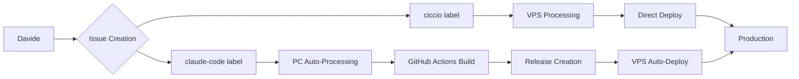

# 80/20 Solutions Workflow Hub

Sistema di workflow standardizzato per lo sviluppo collaborativo AI-assisted con automazione completa.

## 🎯 Overview

Il **Workflow Hub** centralizza tutti i processi di sviluppo 80/20 Solutions, fornendo:

- **GitHub Issues Automation** - Processing automatico con AI
- **Multi-Platform Builds** - GitHub Actions per Flutter, React, Node.js
- **Unified Deployment** - Pipeline automatizzata VPS
- **Team Coordination** - Workflow specializzati per ruolo

## 🚀 Quick Start

### **Per Claude Code (PC Windows):**
```powershell
# One-click installation
irm https://raw.githubusercontent.com/ecologicaleaving/workflow/master/scripts/install-claude-pc.ps1 | iex
```

### **Per Repository (GitHub Actions):**
```bash
# Copy workflow to your repository
cp .github/workflows/build-and-release.yml your-repo/.github/workflows/
```

## 📋 Team Workflow

### **Hybrid System Architecture:**


### **Issue Labels System:**
- `claude-code` → Automatic PC development processing
- `ciccio` → VPS infrastructure/deployment tasks  
- `in-progress` → Currently being processed
- `building` → GitHub Actions building
- `review-ready` → Built and ready for deployment
- `deployed-test` → Live on test environment

## 🔧 Components

### **1. Claude Code PC Automation**
- **Auto-start:** Windows Task Scheduler every 5 minutes
- **Issue Monitoring:** GitHub CLI polling for `claude-code` labels
- **Development:** AI-assisted code implementation
- **Integration:** Git commit + push triggers GitHub Actions

### **2. GitHub Actions Universal Build**
- **Auto-Detection:** Flutter, React, Node.js, Static sites
- **Multi-Platform:** APK, Web builds, Desktop apps
- **Release Management:** Automatic versioning + artifact storage
- **Issue Integration:** Label updates `building` → `review-ready`

### **3. VPS Deployment System**
- **Release Monitoring:** GitHub Releases polling
- **Auto-Deploy:** Test environment deployment
- **Production Pipeline:** Approval-based production deployment
- **Service Management:** nginx, SSL, subdomain configuration

## 📊 Monitoring & Status

### **PC Monitoring:**
```powershell
# Check Claude Code status
C:\claude-workspace\scripts\status.ps1

# View real-time logs  
Get-Content C:\claude-workspace\logs\monitor.log -Wait -Tail 20

# Diagnostic check
C:\claude-workspace\scripts\diagnose.ps1
```

### **GitHub Actions:**
- **Workflow Status:** https://github.com/ecologicaleaving/[repo]/actions
- **Releases:** https://github.com/ecologicaleaving/[repo]/releases
- **Issue Tracking:** Labels automatically updated

### **VPS Deployment:**
- **Apps:** https://apps.8020solutions.org
- **Test Sites:** https://test-[app].8020solutions.org
- **Production:** https://[app].8020solutions.org

## 🛠️ Installation & Setup

### **Requirements:**
- **PC Windows:** PowerShell, Git, GitHub CLI, Claude CLI
- **GitHub Repository:** Private/Public with Actions enabled
- **VPS Access:** nginx, SSL, deploy permissions

### **Step-by-Step Setup:**

**1. PC Setup (Claude Code):**
```powershell
# Run installer script
irm https://raw.githubusercontent.com/ecologicaleaving/workflow/master/scripts/install-claude-pc.ps1 | iex

# Authenticate GitHub
gh auth login --web

# Test installation
C:\claude-workspace\scripts\status.ps1
```

**2. Repository Setup (GitHub Actions):**
```bash
# Copy workflow file to repository
mkdir -p .github/workflows
cp workflow/.github/workflows/build-and-release.yml .github/workflows/

# Commit and push
git add .github/workflows/build-and-release.yml
git commit -m "Add GitHub Actions build workflow"
git push
```

**3. VPS Configuration (Ciccio):**
```bash
# Handled automatically by Ciccio monitoring system
# No manual setup required
```

## 📚 Documentation

### **Core Documents:**
- **[CLAUDE_CODE_PC_SETUP.md](CLAUDE_CODE_PC_SETUP.md)** - PC installation guide
- **[Workflow Commands](scripts/)** - Utility scripts and tools
- **[GitHub Actions](../../github/workflows/)** - Build automation

### **Team Guides:**
- **Davide:** Create issues → automatic processing → approval → production  
- **Claude Code:** Automated - monitors issues every 5 minutes
- **Ciccio:** Automated - monitors releases → deploys → manages infrastructure

## 🔄 Issue Processing Workflow

### **Complete Flow:**
```
1. 📝 Issue Creation (Davide)
   └── Add `claude-code` label for development tasks
   └── Add `ciccio` label for infrastructure tasks

2. 🤖 Auto-Processing (Claude Code PC)
   └── Every 5 minutes: check for `claude-code` labels
   └── AI development: implement solution
   └── Git: commit + push → triggers GitHub Actions
   └── Label: `claude-code` → `building`

3. 🏗️ Build Automation (GitHub Actions)  
   └── Auto-detect: Flutter, React, Node.js
   └── Multi-platform: APK, Web, Static builds
   └── Release: Create GitHub release with artifacts
   └── Label: `building` → `review-ready`

4. 🚀 Deploy Automation (Ciccio VPS)
   └── Monitor: GitHub releases for new artifacts
   └── Deploy: Test environment automatically  
   └── Label: `review-ready` → `deployed-test`
   └── Notify: "Test ready: [link]"

5. ✅ Production (Davide Approval)
   └── Test: Validate functionality  
   └── Approve: "Test OK, go to production"
   └── Deploy: Production environment
   └── Complete: "Live: [link]"
```

## 💡 Key Benefits

### **Automation:**
- ✅ **Zero Manual Intervention** - From issue to test deployment
- ✅ **24/7 Processing** - PC monitors issues continuously
- ✅ **Professional Builds** - GitHub Actions for consistent quality
- ✅ **Instant Deployment** - VPS automatically deploys to test

### **Quality:**
- ✅ **AI-Assisted Development** - Claude Code for implementation
- ✅ **Multi-Platform Support** - APK + Web + Desktop builds
- ✅ **Automated Testing** - Built-in test execution
- ✅ **Version Management** - Semantic versioning + releases

### **Efficiency:**
- ✅ **Parallel Processing** - PC development + VPS infrastructure
- ✅ **Cost Optimization** - GitHub Actions free tier + VPS efficiency
- ✅ **Team Specialization** - Each component handles its expertise
- ✅ **Scalable Architecture** - Easy to add new repositories

## 🔗 Integration

### **Supported Repositories:**
- **StageConnect** - Browser ↔ Device debug tool
- **BeachRef** / **BeachRef-app** - Beach volleyball referee management
- **x32-Assist** - Professional audio mixer control
- **GridConnect** - Electrical grid connection automation
- **finn** - Family expense tracking with AI
- **progetto-casa** - Home renovation management
- **Maestro** - Security automation system
- **AutoDrum** - Reaper automation tools

### **External Services:**
- **GitHub** - Repository hosting + Actions  
- **VPS** - Hetzner CiccioHouse deployment
- **Domains** - 8020solutions.org + subdomains
- **SSL** - Let's Encrypt automatic renewal
- **Monitoring** - OpenClaw system health

---

## 📞 Support

### **Troubleshooting:**
- **PC Issues:** `C:\claude-workspace\scripts\diagnose.ps1`
- **GitHub Actions:** Check workflow logs in repository Actions tab
- **VPS Deploy:** Check Ciccio logs and system status
- **General:** Create issue in this repository with `ciccio` label

### **Contact:**
- **Team:** 80/20 Solutions development team
- **Email:** [Support contact if available]
- **Issues:** Use GitHub Issues with appropriate labels

---

**Version:** 2.0.0  
**Last Updated:** 2026-02-25  
**Status:** Production Ready ✅

*Created by 80/20 Solutions - Empowering SMEs with AI automation*