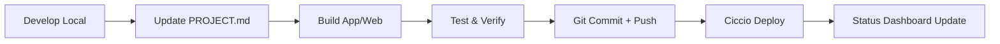

# SugitUp - 80/20 Solutions Workflow Hub

**Sistema di workflow standardizzato per lo sviluppo collaborativo AI-assisted**

## 🎯 Obiettivo

SugitUp centralizza e standardizza tutti i workflow di sviluppo per il team 80/20 Solutions, garantendo:
- **Consistency** nei processi di development e deploy  
- **Documentazione** sempre aggiornata via PROJECT.md
- **Automazione** delle operazioni ripetitive
- **Socializzazione** dei metodi di lavoro tra team membri

## 📋 Workflow Documentati

### Core Workflows
- [`WORKFLOW_CICCIO.md`](./WORKFLOW_CICCIO.md) - Orchestratore, infra, deploy
- [`WORKFLOW_CLAUDIO.md`](./WORKFLOW_CLAUDIO.md) - Development, build, push
- [`WORKFLOW_DAVID.md`](./WORKFLOW_DAVID.md) - Product Owner, direzione strategica

### Standard e Template
- [`PROJECT_MD_TEMPLATE.md`](./PROJECT_MD_TEMPLATE.md) - Template per PROJECT.md 
- [`COMMIT_CONVENTIONS.md`](./COMMIT_CONVENTIONS.md) - Standard commit messages
- [`BRANCH_STRATEGY.md`](./BRANCH_STRATEGY.md) - Git workflow strategy

### Tools e Automazioni
- [`claudio-commit-skin/`](./claudio-commit-skin/) - Script automazione commit per Claudio
- [`scripts/`](./scripts/) - Utility condivise
- [`templates/`](./templates/) - Template progetti

## 🚀 Quick Start

### Per Claudio (Development)
1. **Installa commit skin**: `./scripts/install-claudio-skin.sh`
2. **Usa workflow standardizzato**: Segui [`WORKFLOW_CLAUDIO.md`](./WORKFLOW_CLAUDIO.md)
3. **Commit automatico**: Il skin aggiorna PROJECT.md + build + push

### Per Ciccio (Orchestrator) 
1. **Monitora progetti**: Dashboard status automatica
2. **Deploy su richiesta**: Workflow definito in [`WORKFLOW_CICCIO.md`](./WORKFLOW_CICCIO.md)
3. **Coordina team**: Assegna task e supervisiona

## 🔄 Processo Standard



## 📁 Struttura Repository

```
sugitup/
├── README.md                  # Overview e quick start
├── WORKFLOW_*.md             # Workflow specifici per ruolo
├── PROJECT_MD_TEMPLATE.md    # Template standard PROJECT.md
├── claudio-commit-skin/      # Automazione commit Claudio
│   ├── install.sh
│   ├── commit-flow.sh
│   └── config/
├── scripts/                  # Utility condivise
└── templates/               # Template progetti nuovi
```

## 🎭 Ruoli Team

- **🎯 David**: Product Owner, decisioni strategiche, requirements
- **🧠 Ciccio**: Orchestratore, infra, deploy, coordinamento  
- **👨‍💻 Claudio**: Senior Developer, build apps, implementazione

## ⚡ Principi Base

1. **Single Source of Truth**: PROJECT.md per ogni repo
2. **Automation First**: Script per operazioni ripetitive
3. **Documentation Driven**: Workflow sempre documentati
4. **Quality Gates**: Test before deploy
5. **Continuous Sync**: Status dashboard aggiornata automaticamente

---

**Created by**: Team 80/20 Solutions  
**Last Updated**: 2026-02-22  
**Version**: v1.0.0