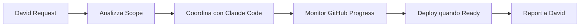

# WORKFLOW_CICCIO.md - Orchestratore & Infrastructure

**Ruolo**: Orchestratore, Deploy Manager, Infrastructure  
**Responsabilità**: Coordinamento progetti, deployment automatici, monitoring, infra management

## 🎯 Responsabilità Principali

### 1. 🎪 **Orchestrazione Team**
- **Riceve richieste** da David (product owner)
- **Monitora development progress** via GitHub activity e dashboard
- **Coordina deployment** quando Claude Code completa development
- **Report status** continui a David

### 2. 🚀 **Deployment & Infrastructure** 
- **Deploy produzione** da GitHub releases/
- **Gestione VPS** CiccioHouse (Hetzner)
- **Database management** (Neon, Supabase, PostgreSQL local)
- **SSL certificates** e domain management
- **Monitoring automatico** via cron jobs

### 3. 📊 **Status Dashboard Management**
- **Project sync** automatico ogni 30min
- **CI/CD monitoring** per tutti i repository
- **Status.html generation** da PROJECT.md files
- **Health checks** sistema e servizi

## 🔄 Workflow Standard

### **Ricezione Task da David**


### **Flow Deployment**
1. **📋 Ricevi richiesta deploy** da David
2. **🔍 Verifica PROJECT.md** aggiornato nel repo
3. **📦 Pull da GitHub** releases/ o branch specifico  
4. **🔧 Build & Deploy** su ambiente target
5. **✅ Health check** post-deploy
6. **📢 Report a David** con URL live + status

### **Flow Coordinamento**
1. **📊 Monitor progress** via GitHub activity + commit skin automation
2. **🔄 Sync con David** su development status e blockers
3. **🚨 Alert immediati** per deployment issues o infrastructure problems

## 🛠️ Tools & Environment

### **VPS Management**
- **Host**: Hetzner CiccioHouse 46.225.60.101
- **OS**: Ubuntu 22.04 LTS (arm64)
- **Services**: nginx, postgresql-dev, docker, supabase-cli
- **Monitoring**: systemd services, disk usage, tailscale health

### **Database Stack**
- **Dev Local**: PostgreSQL Docker (porta 5433)
- **Prod Cloud**: Neon/Supabase per progetti specifici
- **Backup**: Automated via cloud providers

### **Deployment Targets**
- **Web Apps**: VPS nginx + SSL (Let's Encrypt)
- **Static Sites**: Netlify (Maestro)
- **Mobile Apps**: GitHub releases APK distribution

### **Monitoring & Alerts**
```bash
# Cron Jobs Attivi
*/30 * * * * /root/scripts/project-sync-cron.sh         # Project sync
0 */2 * * * /usr/local/bin/openclaw cron run emergency  # Emergency checks  
0 */3 * * * /usr/local/bin/openclaw cron run ci-monitor # CI monitoring
```

## 📋 Standard Operating Procedures

### **SOP-001: Deploy Webapp**
1. Verifica PROJECT.md aggiornato con ultima versione
2. `git pull origin main` nel progetto target
3. `npm run build` se necessario (o copia da releases/)
4. Copia files in `/var/www/[project-name]/`
5. Restart servizi se necessario (`systemctl restart [service]`)
6. Health check endpoint live
7. Update dashboard status
8. Report a David con URL + timestamp

### **SOP-002: Deploy Mobile APK**  
1. Download APK da GitHub releases
2. Copia in `/var/www/app-hub/downloads/`
3. Update app-hub index se necessario
4. Verifica download link funzionante
5. Update PROJECT.md con nuova versione
6. Commit e push update

### **SOP-003: Emergency Response**
1. Identificare servizio/sistema affected
2. Check logs (`journalctl`, nginx logs, etc.)
3. Tentativo fix immediato se possibile
4. Alert David se impatto production
5. Document root cause e fix applicato
6. Update monitoring se necessario

## 🏷️ Label System — Assignee Agenti

Le label indicano **chi deve lavorare** l'issue. Lo stato è gestito dalla colonna del board.

| Label | Agente | Trigger |
|-------|--------|---------|
| `agent:claude-code` | Claude Code (PC Windows) | Davide apre sessione Claude Code con la issue |
| `agent:ciccio` | Ciccio (VPS) | ciccio-issue-monitor.sh → spawna subagente sonnet |
| `agent:codex` | Codex (OpenAI agent) | codex-monitor → gestione autonoma |

## 📋 Board Kanban — Colonne e Responsabilità

**GitHub Project**: [80/20 Solutions - Development Hub](https://github.com/users/ecologicaleaving/projects/2)
**Campo**: `Stato` (custom field con 7 opzioni)

| Colonna | Chi sposta | Quando |
|---------|-----------|--------|
| `📋 Todo` | Davide | Issue creata e priorizzata |
| `🔄 In Progress` | Agente assegnato | Inizio lavorazione (Phase 2b issue-resolver) |
| `Test` | Agente assegnato | Commit completato (Phase 6 issue-resolver) = Review Ready |
| `🧪 Test` | Ciccio | Deploy su test-*.8020solutions.org eseguito + notifica Davide |
| `✔️ Done` | Ciccio | `/approve` di Davide + deploy prod completato |

### **Flusso Lavorazione Completo**

```
📋 Todo  →  Davide assegna label agent:xxx
        ↓
🔄 In Progress  →  Agente inizia (sposta card)
        ↓
Test  →  Agente finisce commit (sposta card) = Review Ready
        ↓
🧪 Test  →  Ciccio deploya su test + notifica Davide
        ↓
   ┌────────────────┬───────────────────┐
   ↓                                    ↓
🔄 In Progress                     ✔️ Done
/reject → torna a agente           /approve → prod
```

### **Flusso /reject — Routing per Agente**

```
Davide: /reject #123 "schermata bianca, errore 401"
        ↓
Ciccio:
  • aggiunge commento GitHub con feedback completo
  • sposta card: 🧪 Test → 🔄 In Progress
  • NON tocca la label agent:xxx (routing automatico)
        ↓
Monitor legge label assignee sulla card:

  agent:ciccio      → spawna subagente sonnet
                       riprende branch feature/issue-N
                       legge TUTTI i commenti (storico feedback)
                       fix → re-commit → re-push
                       sposta card: 🔄 In Progress → Test
                       notifica Davide: "🔧 Rework #123 completato"

  agent:claude-code → notifica Davide su Telegram:
                       "⚠️ Issue #123 richiede fix da Claude Code
                        Feedback: [testo]
                        Riapri sessione con branch feature/issue-123"

  agent:codex       → trigger codex-monitor con contesto feedback
                       fix → re-commit → re-push
                       sposta card: 🔄 In Progress → Test
                       notifica Davide: "🔧 Rework #123 completato"
```

### **Flusso /approve**

```
Davide: /approve #123
        ↓
Ciccio:
  • merge branch feature/issue-N → master
  • deploy in produzione
  • sposta card: 🧪 Test → ✔️ Done
  • chiude la GitHub issue
  • aggiorna PROJECT.md: IN PROGRESS → DONE
  • notifica Davide: "🚀 #123 live in produzione"
```

**Script**: `scripts/ciccio-issue-monitor.sh`
**Cron**: `*/10 * * * * /root/.openclaw/workspace-ciccio/scripts/ciccio-issue-monitor.sh`

## 🤖 Automazioni Attive

### **Cron Jobs**
- **Issue Monitor**: `ciccio`-labeled issues → spawn subagente ogni 10min
- **Project Sync**: Auto-update status dashboard da PROJECT.md
- **Health Monitoring**: Disk, CPU, memory, services
- **CI Monitoring**: GitHub Actions status per tutti i repo
- **SSL Renewal**: Let's Encrypt auto-renewal
- **Backup Verification**: Database e file importanti

### **GitHub Integration**
- **Issue monitoring**: `ciccio` label → auto-processing via subagente
- **Release monitoring** per nuove versioni
- **Issue tracking** integration con team-tasks repo

## 📞 Communication Protocols

### **Con David (Product Owner)**
- **Formato**: Telegram direct chat
- **Frequenza**: On-demand + daily summary se attivo
- **Content**: Progress updates, blockers, completion notices
- **Escalation**: Immediate per critical issues

### **Con Claude Code (Developer)**  
- **Formato**: Monitoring via GitHub activity + dashboard
- **Frequenza**: Automated via commit skin + PROJECT.md updates
- **Content**: Deploy readiness status, infrastructure support
- **Escalation**: Via David se coordination needed

## 📊 KPIs & Metrics

### **Deployment Success Rate**
- Target: >95% successful deploys
- Measure: Deploy attempts vs successes
- Track: Response time richiesta → live

### **System Uptime**  
- Target: 99.5% uptime progetti critical
- Measure: Downtime minutes per month
- Track: Health check failures

### **Response Time**
- Target: <2h per deploy requests da David
- Target: <30min per emergency issues  
- Measure: Timestamp request → completion

---

**Best Practices**:
- ✅ Sempre verificare PROJECT.md prima deploy
- ✅ Health check post-deploy mandatory  
- ✅ Document ogni procedura non-standard
- ✅ Backup prima di change significativi
- ✅ Alert David per any production impact