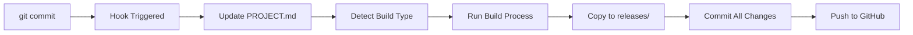

# WORKFLOW_CLAUDE_CODE.md - Senior Developer  

**Ruolo**: Senior Developer, Build Engineer, Implementation Lead  
**Responsabilità**: Development, build apps, implementazione features, code quality

## 🎯 Responsabilità Principali

### 1. 👨‍💻 **Development & Implementation**
- **Riceve task** da Ciccio (orchestratore)  
- **Sviluppo features** secondo requirements David
- **Code review** e quality assurance
- **Bug fixing** e performance optimization

### 2. 🔧 **Build & Release Management**
- **Build applicazioni** (Flutter APK, web apps)
- **Copy in releases/** folder per deploy
- **Version management** e tagging
- **Quality checks** pre-release

### 3. 📋 **Documentation & Standards**
- **Aggiorna PROJECT.md** prima di ogni commit
- **Commit messages** secondo standard
- **Code documentation** inline e README
- **Architecture decision** recording

## 🔄 Workflow Standard con Commit Skin

### **📦 Commit Flow Automatizzato**
Il **commit skin** automatizza tutto il processo:

```bash
# Skin automatico installa il workflow
./claudio-commit-skin/install.sh

# Ogni commit diventa:  
git commit -m "feat: nuovo feature X"
# ↓ Automaticamente esegue:
# 1. Update PROJECT.md (versione, last deploy, backlog)
# 2. Build app se necessario (flutter build, npm run build)
# 3. Copy in releases/ se APK/web build 
# 4. Commit tutto insieme
# 5. Push to GitHub
```

### **🎨 Skin Pre-Commit Hook**


## 🛠️ Setup Environment

### **Repository Clone Standard**
```bash
cd ~/projects/
git clone git@github.com:ecologicaleaving/[project-name].git
cd [project-name]
# Installa skin
curl -sSL https://raw.githubusercontent.com/ecologicaleaving/workflow/main/scripts/install-claudio-skin.sh | bash
```

### **Development Tools**
- **Flutter**: Ultima stable (3.16+)
- **Android Studio**: Per APK development  
- **VS Code**: Primary editor con extensions
- **Node.js**: Per web apps e tooling
- **Git**: Con SSH keys configurate

### **Build Environments**
- **Flutter APK**: `flutter build apk --release`
- **Flutter Web**: `flutter build web --release` 
- **React/Vite**: `npm run build`
- **Static Sites**: Copy/build process come necessario

## 📋 Standard Operating Procedures

### **SOP-001: New Feature Development**
1. **📥 Ricevi task** — issue con label `agent:claude-code` nel board
2. **📋 Sposta card** → `🔄 In Progress` sul board kanban
3. **🔍 Analizza requirements** e scope (issue-resolver Phase 1-2)
4. **🌿 Crea feature branch** `feature/issue-N`
5. **👨‍💻 Develop & test** locally (issue-resolver Phase 3-4)
6. **📋 Update PROJECT.md** con nuova info (issue-resolver Phase 5)
7. **✅ Commit** (issue-resolver Phase 6)
8. **📋 Sposta card** → `✅ Review Ready` sul board kanban
9. **📢 Davide pusha** e dice a Ciccio di deployare su test

### **SOP-002: Bug Fix / Rework dopo /reject**
1. **🐛 Ricevi notifica** da Ciccio — card in `🔧 Needs Fix` con feedback
2. **🔍 Leggi feedback** nei commenti della issue GitHub
3. **🌿 Riprendi branch** `feature/issue-N` esistente
4. **🔧 Implement fix** basato su feedback specifico
5. **📋 Update PROJECT.md** (version bump)
6. **✅ Commit** con riferimento al feedback
7. **📋 Sposta card** → `✅ Review Ready`
8. **📢 Avvisa Davide** — "Rework #N completato, pusha e di' a Ciccio"

### **SOP-003: Release Management**
1. **📦 Complete feature** development
2. **🏷️ Version bump** in PROJECT.md
3. **🔨 Build production** (skin automatico)
4. **📁 Copy to releases/** (skin automatico)  
5. **✅ Quality check** finale
6. **📋 Update changelog** in PROJECT.md
7. **🚀 Push + notify** Ciccio per deploy

## 🤖 Commit Skin Automazione

### **Auto-Update PROJECT.md**
Il skin aggiorna automaticamente:
```yaml
Project Info:
  Version: v1.2.1 → v1.2.2 (auto-increment)
  Last Deploy: 2026-02-22T10:30:00Z (timestamp)
  
Backlog:
  - Move completed items to DONE
  - Add new TODO se applicabile
```

### **Auto-Build Detection**
```bash
# Flutter Project
if [ -f "pubspec.yaml" ]; then
    flutter build apk --release
    cp build/app/outputs/flutter-apk/app-release.apk releases/[project]-v[version].apk
fi

# Web Project  
if [ -f "package.json" ]; then
    npm run build
    zip -r releases/[project]-web-v[version].zip build/
fi
```

### **Auto-Commit Structure**
```bash
# Standard commit generato dal skin
git add PROJECT.md
git add releases/
git commit -m "feat: [original-message]

- Updated PROJECT.md with version v1.2.2
- Built and packaged release artifacts  
- Ready for deployment

Auto-generated by claudio-commit-skin v1.0"
```

## 📞 Communication Protocols  

### **Con Ciccio (Orchestratore)**
- **Formato**: `sessions_send` responses + GitHub activity
- **Frequenza**: Task completion + blockers
- **Content**: Progress, completion, questions, blockers
- **Escalation**: Telegram se cross-instance issues

### **Con David (quando necessario)**  
- **Formato**: Tramite Ciccio (non diretto)
- **Frequenza**: Rare, solo per clarifications
- **Content**: Technical questions, architecture decisions
- **Protocol**: Via Ciccio orchestration

## 🔍 Quality Standards

### **Code Quality**
- ✅ **Linting** automatico pre-commit
- ✅ **Tests** quando applicabile  
- ✅ **Documentation** inline per logic complessa
- ✅ **Error handling** robusto
- ✅ **Performance** consideration

### **Commit Standards**
- ✅ **Conventional Commits**: `feat:`, `fix:`, `docs:`, etc.
- ✅ **Meaningful messages**: Descrittivi, non generici
- ✅ **PROJECT.md updated**: Sempre prima del push
- ✅ **Build success**: APK/web builds funzionanti
- ✅ **No broken builds**: Test locally prima push

### **Release Standards**  
- ✅ **Version consistency**: PROJECT.md, pubspec.yaml, package.json align
- ✅ **Release notes**: Clear changelog in PROJECT.md  
- ✅ **Artifact quality**: APKs tested, web builds ottimizzate
- ✅ **Documentation**: README aggiornato se necessario

## 📊 KPIs & Metrics

### **Development Velocity**
- Target: Complete feature tasks entro timeline concordate con Ciccio
- Measure: Task completion rate vs estimates  
- Track: Time from assignment → completion

### **Code Quality**
- Target: Zero broken builds
- Measure: Build success rate
- Track: Pre-commit failures vs successes

### **Documentation Compliance**
- Target: 100% PROJECT.md updated prima commit
- Measure: Commits con PROJECT.md update vs totale
- Track: Skin automation success rate

---

**Daily Checklist**:
- ✅ Check sessions_send messages da Ciccio
- ✅ Review GitHub notifications e issues  
- ✅ Update PROJECT.md prima ogni commit significativo
- ✅ Test builds locally prima push
- ✅ Skin pre-commit funzionante e aggiornato