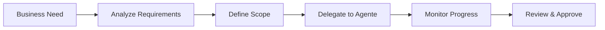

> ⚠️ **DEPRECATO** — Questo file è storico. Fonte di verità aggiornata: `WORKFLOW.md`
> Ruoli attivi: solo **Davide** (Product Owner) e **Agente** (Claude Code). Ciccio non è più attivo.

# WORKFLOW_DAVID.md - Product Owner & Strategic Lead

**Ruolo**: Product Owner, Strategic Decision Maker, Business Lead  
**Responsabilità**: Vision, requirements, prioritization, business decisions

## 🎯 Responsabilità Principali

### 1. 🎨 **Product Vision & Strategy**
- **Definisce vision** e roadmap prodotti
- **Prioritizza features** basato su business value
- **Decide architettura** e scelte tecnologiche high-level
- **Gestisce stakeholder** e client requirements

### 2. 📋 **Requirements & Coordination**  
- **Delega task** all'Agente (Claude Code)
- **Review deliverable** e approva releases
- **Feedback cycle** su feature implementations
- **Business validation** delle soluzioni

### 3. 💼 **Business Operations**
- **Client relationship** management
- **Contract negotiations** e project scoping
- **Resource allocation** e budget decisions
- **Market strategy** e competitive analysis

## 🔄 Workflow Standard

### **📊 Strategic Planning Flow**

### **🎯 Task Delegation Process**
1. **💭 Identifica business need** o opportunity
2. **📋 Definisce requirements** e acceptance criteria
3. **🎯 Assegna issue** con label `agent:claude-code`
4. **📋 Metti card in Backlog** sul [board kanban](https://github.com/users/ecologicaleaving/projects/2)
5. **📊 Monitor progress** — board mostra colonna attuale di ogni issue
6. **✅ Ricevi notifica** dall'Agente quando card è in `👀 Needs Review`
7. **🔍 Testa su** test-*.8020solutions.org
8. **🚀 Decidi**: `/approve #N` oppure `/reject #N "feedback dettagliato"`

### **📋 Comandi Review**

| Comando | Effetto |
|---------|---------|
| `/approve #123` | Agente mergia in master, deploya in prod, chiude issue, card → ✔️ Done |
| `/reject #123 "feedback"` | Agente aggiunge commento, card → 🔧 Needs Fix, rework |

### **📈 Project Review Cycle**
- **Daily**: Check [board kanban](https://github.com/users/ecologicaleaving/projects/2) per stato issue
- **Weekly**: Review progress con l'Agente se progetti attivi
- **Monthly**: Strategic review e roadmap adjustments
- **Quarterly**: Business metrics e team performance review

## 🛠️ Tools & Interfaces

### **Primary Communication**
- **Agente**: Claude Code sessions per task delegation
- **Team**: Telegram group 8020dev per discussioni
- **External**: Email, calls, meetings per client/business

### **Monitoring & Dashboards**
- **Status Dashboard**: https://app.8020solutions.org/status.html
- **GitHub Issues**: https://github.com/80-20Solutions/team-tasks  
- **PROJECT.md Files**: Single source of truth per progetto
- **Calendar**: gog CLI integration per scheduling

### **Business Tools**
- **Email**: dadecresce@gmail.com (via gog CLI)
- **Calendar**: Google Calendar integration
- **Documents**: Google Drive/Docs per business docs
- **Finance**: Tracking tramite spreadsheet e tools esterni

## 📋 Standard Operating Procedures

### **SOP-001: New Project Initiation**
1. **💡 Business opportunity** identification
2. **🔍 Market research** e feasibility analysis
3. **📊 Scope definition** e resource requirements
4. **📋 Create GitHub Issue** nel team-tasks repo
5. **🎯 Delegate to Agente** con detailed brief
6. **📅 Set milestones** e review points
7. **📊 Monitor via dashboard** e regular check-ins

### **SOP-002: Feature Request Process**
1. **📨 Ricevi feature request** (client, internal, market)
2. **💰 Valuta business value** vs development effort
3. **📊 Prioritize** nel backlog complessivo  
4. **📝 Define acceptance criteria** dettagliati
5. **🎯 Assign to Agente** per implementation planning
6. **⏰ Set timeline** e budget constraints
7. **✅ Review implementation** pre-release

### **SOP-003: Crisis Management**
1. **🚨 Issue escalation** da Agente o esterni
2. **🔍 Rapid assessment** di impact e urgency
3. **📞 Client communication** se necessario
4. **🎯 Direct Agente** per immediate action
5. **📊 Monitor resolution** progress
6. **📋 Post-mortem** e process improvement
7. **📢 Stakeholder update** su resolution

## 🎯 Decision Framework

### **Priority Matrix**
| Urgency | Business Value High | Business Value Low |
|---------|---------------------|-------------------|
| **High** | 🔴 Immediate (Agente direct) | 🟡 Schedule next sprint |
| **Low**  | 🟢 Plan current sprint | ⚫ Backlog for later |

### **Resource Allocation**
- **🚀 Production Issues**: Immediate attention
- **💰 Revenue-Generating Features**: High priority
- **🔧 Technical Debt**: Planned maintenance windows  
- **🧪 R&D Projects**: Time-boxed exploration
- **📚 Documentation**: Continuous improvement

### **Go/No-Go Criteria**
✅ **GO**:
- Clear business value
- Defined success metrics
- Resource availability confirmed
- Technical feasibility validated

❌ **NO-GO**:
- Unclear ROI
- Resource constraints
- Technical risks too high  
- Not aligned with strategy

## 📞 Communication Protocols

### **Con Agente (Primary)**
- **Formato**: Claude Code sessions
- **Frequenza**: On-demand per task
- **Content**: Task delegation, requirements, approvals, questions
- **Response Time**: Sincrono durante la sessione

### **Con Team (Group)**
- **Formato**: Telegram 8020dev group
- **Frequenza**: Weekly updates + ad-hoc discussions
- **Content**: General updates, brainstorming, announcements
- **Protocol**: Keep focused, move detailed discussions to direct

### **External Stakeholders**
- **Clients**: Email + calls + meetings
- **Partners**: Professional communication channels
- **Investors**: Formal reporting e presentations

## 📊 KPIs & Success Metrics

### **Business Metrics**
- **Revenue Growth**: Monthly recurring revenue trends
- **Client Satisfaction**: Feedback scores e retention rate
- **Project ROI**: Revenue impact vs development investment
- **Time to Market**: Idea → production deployment time

### **Team Efficiency**
- **Delivery Velocity**: Features completed per sprint
- **Quality Metrics**: Bug rate post-deployment  
- **Response Time**: Request → first deliverable
- **Team Satisfaction**: Regular team health checks

### **Strategic Metrics**
- **Market Position**: Competitive analysis e market share
- **Innovation Rate**: New products/features per quarter
- **Technical Debt**: Maintenance overhead vs new development
- **Scalability**: System capacity vs business growth

## 🔄 Review & Optimization

### **Weekly Review**
- 📊 **Status Dashboard** check per all projects
- 📈 **KPI review** e trend analysis
- 🎯 **Priority adjustment** se necessario
- 📞 **Team check-in** con l'Agente

### **Monthly Strategic Review**  
- 📋 **Roadmap validation** vs market changes
- 💰 **Resource allocation** review
- 📊 **Performance metrics** deep dive
- 🎯 **Goal adjustment** per next month

### **Quarterly Business Review**
- 📈 **Business results** vs objectives
- 🎨 **Strategy refinement** basato su learnings
- 👥 **Team development** e skill gaps
- 💡 **Innovation pipeline** review

---

**Best Practices**:
- ✅ Clear communication con context completo
- ✅ Document decisions e rationale  
- ✅ Regular review ma avoid micromanagement
- ✅ Business focus mantenendo technical awareness
- ✅ Celebrate team wins e learn from failures